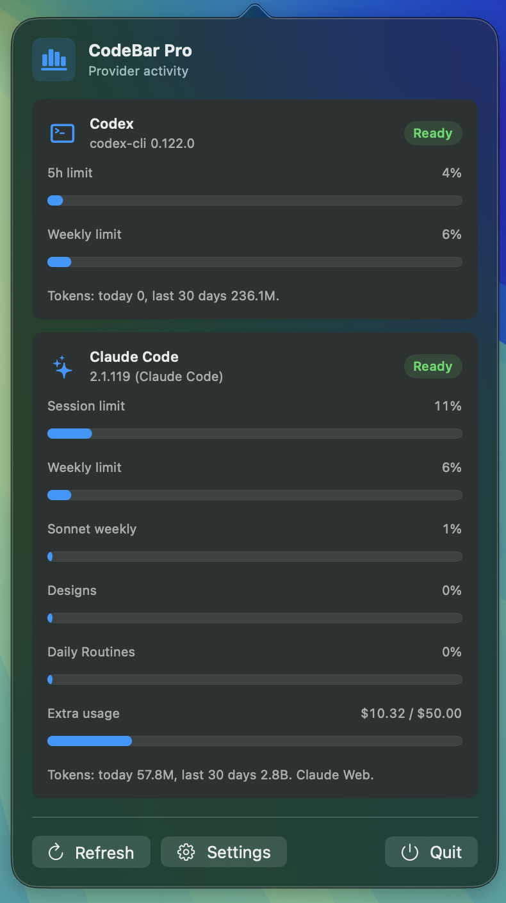

# CodeBar Pro


[中文说明](README.zh-CN.md)

CodeBar Pro is a polished native macOS menu bar app for keeping an eye on local AI coding assistant activity. It turns scattered local usage logs into a compact menu bar signal, a readable popover, and a small set of practical controls.

It is built for developers who want quick visibility without opening a terminal, digging through JSONL files, or switching into a dashboard.

<p align="center">
  
</p>

## ✨ Highlights

- 🧭 **Menu bar first** - lives quietly in the macOS menu bar with no Dock icon.
- 📊 **Fast usage overview** - shows today and last-30-days activity for each provider.
- 📈 **Quota percentages** - surfaces Codex 5-hour/weekly percentages plus Claude Code session, weekly, Sonnet/Opus, Designs, Daily Routines, and Extra usage metrics when available.
- 🔢 **Token-aware metrics** - prefers token counters when available and falls back to event counts.
- 🧩 **Multiple providers** - supports Codex and Claude Code activity sources.
- 🔍 **Local CLI detection** - checks installed command-line tools and shows version details.
- 🕒 **Flexible refresh** - choose manual refresh or automatic intervals.
- 🎛️ **Provider toggles** - enable or disable providers independently.
- 🛡️ **Local-first privacy** - scans local files by default and only contacts provider usage endpoints for supported quota percentages.
- ⚙️ **Native implementation** - AppKit status item, SwiftUI views, and no web wrapper.

## 🖥️ What You See

CodeBar Pro gives you three main surfaces:

| Surface | Purpose |
| --- | --- |
| Menu bar item | Shows the active provider name or current used amount. |
| Popover | Displays provider cards, status, quota percentages or usage totals, and refresh controls. |
| Settings window | Lets you configure providers, refresh cadence, and menu bar display behavior. |

## 📦 Requirements

- macOS 14.0 or later.
- Xcode 16 or later.
- Optional: `codex` and/or `claude` CLI installed for version detection.
- Optional: Claude Code OAuth credentials, a readable Chrome/Edge/Brave/Arc `claude.ai` browser session, or a working `claude` CLI for Claude Code quota percentages and supplemental usage windows.
- Local provider activity logs, when available:
  - `~/.codex`
  - `~/.claude/projects`

The app still opens when a CLI or log directory is missing. Missing providers are shown clearly in the UI instead of failing silently.

## 🚀 Run From Xcode

Open the project:

```bash
open CodeBarPro.xcodeproj
```

Then:

1. Select the `CodeBarPro` scheme.
2. Choose `My Mac` as the destination.
3. Press Run.

The app appears in the macOS menu bar as an accessory app.

## 🛠️ Build From Terminal

```bash
xcodebuild build \
  -project CodeBarPro.xcodeproj \
  -scheme CodeBarPro \
  -destination 'platform=macOS' \
  CODE_SIGNING_ALLOWED=NO
```

## ✅ Test

```bash
xcodebuild test \
  -project CodeBarPro.xcodeproj \
  -scheme CodeBarPro \
  -destination 'platform=macOS' \
  -test-timeouts-enabled YES \
  -maximum-test-execution-time-allowance 30 \
  CODE_SIGNING_ALLOWED=NO
```

Current test coverage focuses on:

- JSONL token scanning.
- Per-record date bucketing.
- Deduplication of nested log roots.
- Cache invalidation when files change.
- Command execution, timeout handling, large output draining, and non-zero exits.
- Preference persistence for refresh cadence and provider enablement.
- Claude Code quota parsing from OAuth, browser-session, and CLI fallback paths, including model-specific and supplemental usage windows.

## 🧠 How It Works

CodeBar Pro collects data through a small local pipeline:

1. Resolve provider CLIs from common shell paths and Node version manager paths.
2. Run version checks with bounded command timeouts.
3. Discover local JSONL activity logs.
4. Deduplicate discovered file paths.
5. Scan the most recent logs first.
6. Parse each JSONL record and bucket usage by record timestamp.
7. Extract Codex rate-limit percentages when present.
8. Fetch Claude Code OAuth usage percentages when credentials are available.
9. Map Claude session, weekly, Sonnet/Opus, Designs, Daily Routines, and Extra usage data when the source provides it.
10. If Claude OAuth is rate limited or unavailable, use the local `claude.ai` browser session to query Claude Web usage and Extra usage spend.
11. If the browser-session path is unavailable, try the Claude CLI `/usage` fallback for session, weekly, and model-specific percentages.
12. Publish provider snapshots back to the menu bar UI.

The scanner caps work to the most recent 1,500 JSONL files per provider to keep refreshes responsive.

## 🔐 Privacy Model

CodeBar Pro is designed around local inspection:

- It reads local usage logs from your Mac.
- It runs local CLI version checks.
- For Claude Code quota percentages, it can read Claude Code OAuth credentials from Keychain or `~/.claude/.credentials.json` and call Anthropic's usage endpoint.
- If the Claude OAuth endpoint is temporarily rate limited or unavailable, it can read local `claude.ai` browser session cookies from Chrome, Edge, Brave, or Arc and call Claude Web usage and overage endpoints.
- If browser-session usage is unavailable, it can run the local `claude` CLI in a short-lived PTY session and parse `/usage`.
- It does not upload local JSONL logs, prompts, or transcript content.
- If all Claude quota sources fail, it falls back to local token totals.

If your local provider logs contain sensitive prompts or metadata, they remain on disk where those provider tools already stored them. CodeBar Pro only computes aggregate counts for display.

## ⚙️ Preferences

| Setting | Description |
| --- | --- |
| Providers | Turn Codex and Claude Code monitoring on or off independently. |
| Cadence | Pick manual, 1 minute, 2 minutes, 5 minutes, or 15 minutes. |
| Refresh Now | Immediately re-scan enabled providers. |
| Show used amount | Replace the menu bar provider label with the current usage value. |
| Open local folders | Jump directly to `.codex` or `.claude` in Finder. |

## 🧱 Project Structure

```text
CodeBarPro/
├── CodeBarPro.xcodeproj
├── CodeBarPro/
│   ├── AppPreferences.swift
│   ├── ClaudeUsageProbe.swift
│   ├── CodeBarProApp.swift
│   ├── MenuBarViews.swift
│   ├── ProviderProbe.swift
│   ├── SettingsView.swift
│   ├── StatusItemController.swift
│   ├── UsageModels.swift
│   └── UsageStore.swift
├── CodeBarProTests/
│   └── CodeBarProTests.swift
├── CodeBarProUITests/
└── README.zh-CN.md
```

## 🧰 Troubleshooting

### CLI Missing

Install the relevant command-line tool or make sure it is available from your shell `PATH`. CodeBar Pro checks common macOS shell paths and local Node version manager folders.

### No local JSONL activity logs found

Open the provider tool normally and run at least one session. CodeBar Pro can only summarize activity that exists in local logs.

### Usage looks lower than expected

Some logs may contain event records without token counters. In that case CodeBar Pro reports event totals instead of guessing token usage.

### Claude quota percentages are unavailable

Claude Code quota percentages require at least one available quota source: readable Claude Code OAuth credentials, a readable `claude.ai` browser session in Chrome/Edge/Brave/Arc, or a working local `claude` CLI `/usage` panel. OAuth and Web sources can expose supplemental windows such as Sonnet/Opus, Designs, Daily Routines, and Extra usage. CLI fallback is limited to what the `/usage` panel prints. If the OAuth endpoint returns HTTP 429, CodeBar Pro records the `Retry-After` window, skips repeated OAuth calls during that backoff, tries Claude Web usage through the browser session, then tries the CLI fallback before showing local token totals.

### Xcode opens but the app is not visible

CodeBar Pro is a menu bar utility. Look for the menu bar item near the right side of the macOS menu bar rather than in the Dock.

## 🗺️ Roadmap Ideas

- Optional screenshot assets for the README.
- Exportable usage summaries.
- More provider adapters.
- Custom log directory configuration.
- Signed release builds.

## 🤝 Contributing

Small, focused changes are easiest to review. Useful contributions include provider parsing improvements, test cases for new log formats, and UI refinements that preserve the lightweight menu bar workflow.
